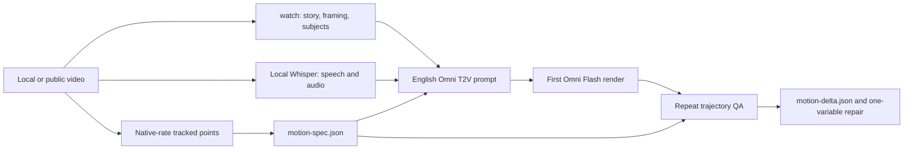

# TikTok to Omni Video

[简体中文](README.md) · **English**

> Compile story, audio, and high-temporal-motion evidence from a short video into auditable Omni Flash T2V recreation prompts.

[](https://github.com/peipeijiang/tiktok-to-omni-video/actions/workflows/ci.yml) [](https://www.python.org/) [](LICENSE)

TikTok to Omni Video keeps the original story, audio, comedy, and continuity analysis while adding native-frame-rate motion analysis. `watch` answers *what happens and why it lands*; tracked points answer *how fast, how far, and in which alternating order*. Both constrain an English Omni Flash text prompt and the generated take is measured with the same motion contract.

## Pipeline



## Quick start

Python 3.10+ is required. Full video analysis also requires the original skill's `ffmpeg`, `ffprobe`, and local Whisper prerequisites. This repository contains no source videos, frames, audio, task manifests, or keys.

Convert point tracks exported by CoTracker or another tracker to normalized CSV, then build a motion specification:

```bash
python3 -m pip install -r requirements-motion.txt

python3 scripts/cotracker_npz_to_csv.py paw-tracks.npz \
  --out tracks.csv --prefix paw

python3 scripts/build_motion_spec.py tracks.csv \
  --fps 30 --left paw0,paw1 --right paw2,paw3 --axis 1 0 \
  --out artifacts/source-motion-spec.json

python3 scripts/render_omni_motion_block.py artifacts/source-motion-spec.json \
  --subject "The hairless cat" --target "the black sofa"
```

The final command prints an English motion paragraph that can be inserted into an Omni prompt. It never emits Seedance tags, image/video reference tags, or upload instructions.

## Outputs

| Artifact | Purpose |
|---|---|
| `watch` frames and local audio analysis | Camera, subjects, props, causal action, comedy, and audio evidence |
| `tracks.csv` | Native-rate point tracks; one visible point position per row |
| `motion-spec.json` | Extension timing, stroke rate, amplitude, peak speed, and alternation |
| English Omni prompt | Scene and causality locks plus measurable motion and continuity constraints |
| `motion-delta.json` | Source-versus-output cadence, amplitude, speed, and alternation differences |

## Omni Flash only

This is a T2V-only workflow: prompts contain English natural language, never `@Video1`, `@Image1`, or reference-upload syntax. Each job is a 10-second, 9:16, 720P continuous phone shot. The first job must download and pass container, duration, and dimension checks before the queue continues.

A fast action needs an actor, forward direction, measured rate, extension-to-recoil path, stable anchors, and an endpoint. `fast punches` is not enough; use the measured cadence, compact guard, short extension, and immediate recoil. See [motion analysis](docs/motion-analysis.md) and the [Omni prompt contract](docs/omni-prompt-contract.md).

## Motion QA

Run the same point groups and action axis on the generated output:

```bash
python3 scripts/build_motion_spec.py generated-tracks.csv \
  --fps 30 --left paw0,paw1 --right paw2,paw3 --axis 1 0 \
  --out artifacts/output-motion-spec.json

python3 scripts/compare_motion_specs.py artifacts/source-motion-spec.json \
  artifacts/output-motion-spec.json --out artifacts/motion-delta.json
```

When cadence misses, revise only the motion paragraph and preserve subject, environment, camera, and audio locks. Do not infer a model-internal cause from one failed take.

## Optional CoTracker

[CoTracker](https://github.com/facebookresearch/co-tracker) can follow arbitrary pixels in non-standard animal poses such as Sphynx forepaws. It is optional: this project accepts any tracker that emits the documented [CSV schema](docs/motion-analysis.md#track-schema). Review CoTracker's license and hardware requirements before use.

## Privacy, rights, and limitations

- Analyze only media you own, are licensed to use, or are authorized to process. Do not publish source video, private likenesses, readable watermarks, or brand marks.
- API keys are read only from environment variables, never from job JSON, logs, or this repository.
- Measured motion constraints improve T2V control; they cannot guarantee pixel- or trajectory-identical output.
- The pre-upgrade skill snapshot is retained in [archive/original-skill](archive/original-skill) for auditability.

## Development

```bash
python3 -m unittest discover -s tests -v
```

Contributions are welcome through Issues and Pull Requests. See [troubleshooting](docs/troubleshooting.md).

## License

[MIT](LICENSE)
