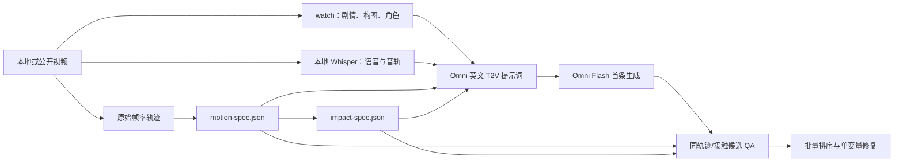

# TikTok to Omni Video

**简体中文** · [English](README.en.md)

> 将本地或公开短视频中的故事、声音与高速动作证据，编译为可核验的 Omni Flash T2V 复刻提示词。

[](https://github.com/peipeijiang/tiktok-to-omni-video/actions/workflows/ci.yml) [](https://www.python.org/) [](LICENSE)

TikTok to Omni Video 保留原有的剧情、音频、笑点和连续性分析，并新增原始帧率运动分析。`watch` 回答“发生了什么、为何好笑”；轨迹分析回答“多快、移动多远、左右如何交替”。两者共同约束英文 Omni Flash 文本提示词，并在成片后以相同指标验收。

## 工作流



## 快速开始

需要 Python 3.10+。完整视频分析还需要原技能已要求的 `ffmpeg`、`ffprobe` 和一个本地 Whisper 后端。仓库不包含任何视频、帧、音频、任务清单或密钥。

将 CoTracker 或其他追踪器导出的点轨迹转换为统一 CSV，再构建运动规格：

```bash
python3 -m pip install -r requirements-motion.txt

python3 scripts/cotracker_npz_to_csv.py paw-tracks.npz \
  --out tracks.csv --prefix paw

python3 scripts/build_motion_spec.py tracks.csv \
  --fps 30 --left paw0,paw1 --right paw2,paw3 --axis 1 0 \
  --out artifacts/source-motion-spec.json

python3 scripts/render_omni_motion_block.py artifacts/source-motion-spec.json \
  --subject "The hairless cat" --target "the black sofa"
```

最后一条命令输出可嵌入 Omni 英文提示词的运动段。它不会生成 Seedance 标签、图像/视频引用标签，或上传指令。

## 产物与用途

| 产物 | 用途 |
|---|---|
| `watch` 帧与本地音频分析 | 固定镜头、角色、道具、动作因果、笑点和声音证据 |
| `tracks.csv` | 原始帧率点轨迹；每行是一个可见点的位置 |
| `motion-spec.json` | 前冲时间、连击速率、振幅、峰值速度、左右交替 |
| `impact-spec.json` | 发力锚点、目标点、几何接触候选、可见目标反馈 |
| Omni 英文提示词 | 场景与因果锁 + 可测量运动段 + 连续性约束 |
| `motion-delta.json` | 原片与成片在节奏、振幅、速度、交替性上的差异 |

## Omni Flash 专用原则

这是纯 T2V 工作流：提示词只写英文自然语言，不写 `@Video1`、`@Image1` 或上传引用。每条任务固定为 10 秒、9:16、720P、一个连续手机镜头；首条任务下载并通过容器、时长和尺寸检查后才允许继续队列。

对于高速动作，提示词必须包含动作主体、前冲方向、测得频率、前冲→回收路径、稳定物和终态。例如，不能只写 `fast punches`，而要写每只前爪的测得连击速率、紧凑起手、短路径前冲和立即回收。完整规则见 [运动分析文档](docs/motion-analysis.md) 与 [Omni 提示词契约](docs/omni-prompt-contract.md)。

## 快速批量与击中感

批量任务默认不下载模型权重：使用 OpenCV 光流、原始帧率轨迹和缓存 JSON。对每条源视频只分析一次，再自动编译 `cadence`、`impact`、`framing` 三个 Omni 配方；成片按速率、交替和几何接触候选排序，只重试一个失败维度。完整命令、批次 JSON 格式与“几何接触不是物理仿真”的限制见 [批量冲量工作流](docs/batch-impact-workflow.md)。

## 运动 QA

对 Omni 成片重复使用同一组追踪点和动作轴：

```bash
python3 scripts/build_motion_spec.py generated-tracks.csv \
  --fps 30 --left paw0,paw1 --right paw2,paw3 --axis 1 0 \
  --out artifacts/output-motion-spec.json

python3 scripts/compare_motion_specs.py artifacts/source-motion-spec.json \
  artifacts/output-motion-spec.json --out artifacts/motion-delta.json
```

如果连击频率不足，只修改运动段并保留角色、环境、镜头和音频锁。不要将一次失败归因为模型内部机制，也不要同时改变多个变量。

## 可选 CoTracker

[CoTracker](https://github.com/facebookresearch/co-tracker) 适合追踪无毛猫前爪这类非标准姿态的任意像素点。它是可选依赖：本项目也接受任何符合 [CSV schema](docs/motion-analysis.md#轨迹格式) 的追踪器结果。请在使用前核对 CoTracker 的许可及硬件要求。

## 隐私、授权与限制

- 仅分析你拥有、获许可或有权处理的素材；不要公开上传原视频、人物肖像、可读水印或品牌素材。
- API 密钥只从环境变量读取，绝不写入任务 JSON、日志或仓库。
- 量化运动约束能提高 T2V 的可控性，但不能保证逐像素或逐轨迹完全一致。
- 初始版本备份保存在 [archive/original-skill](archive/original-skill)，便于审计升级前后差异。

## 开发

```bash
python3 -m unittest discover -s tests -v
```

欢迎通过 Issue 或 Pull Request 提交追踪器适配器、测试样本的合成轨迹或文档改进。详见 [故障排查](docs/troubleshooting.md)。

## 许可证

[MIT](LICENSE)
